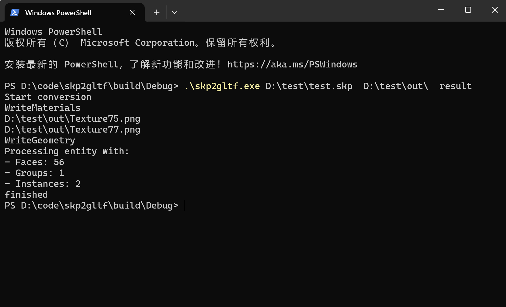
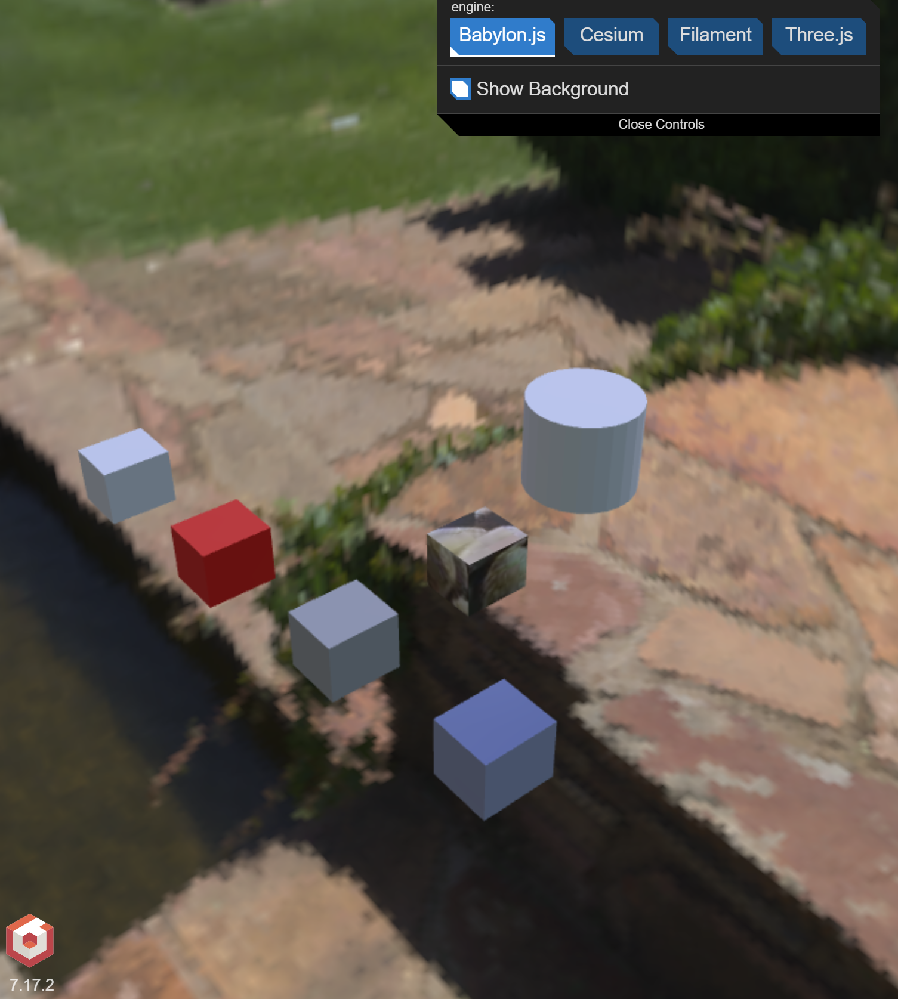

<p align="center">
  <a href="./README.md">简体中文</a>  | 
  <a href="./README_en.md">English</a>
</p>

# SKP2GLTF

A tool for converting SketchUp (.skp) files to glTF/GLB format. Supports Draco mesh compression, which can significantly reduce the output file size.

## Features

- Support for converting SketchUp (.skp) files to glTF/GLB format
- Integrated Draco compression algorithm for effective file size reduction
- Support for materials, textures, and geometry data conversion
- Support for custom compression parameter configuration
- Support for batch file processing

## Screenshots

### Command Line Interface


### Conversion Result Preview


## System Requirements

- Operating System: Windows and Windows Server platforms only
  - Windows 10/11 64-bit
  - Windows Server 2016/2019/2022
- Other Requirements:
  - Visual Studio 2019 or higher (for compilation)
  - SketchUp 2019 or higher (for runtime environment)

## Dependencies

- SketchUp SDK (2019+)
- Draco Compression Library
- TinyGLTF
- CMake (Build System)

## Build Instructions

1. Ensure CMake and a supported C++ compiler are installed
2. Clone the repository:
   ```bash
   git clone <repository-url>
   cd skp2gltf
   ```
3. Create a build directory:
   ```bash
   mkdir build && cd build
   ```
4. Configure and build the project:
   ```bash
   cmake ..
   cmake --build .
   ```

## Usage

### Basic Usage

After compilation, the executable `skp2gltf.exe` is located in the `build/Debug` or `build/Release` directory (depending on the build configuration).

Command line format:
```bash
skp2gltf.exe <input.skp> <output_dir> <output_name>
```

Parameter description:
- `<input.skp>`: Input SketchUp file path
- `<output_dir>`: Output directory path
- `<output_name>`: Output file name (extension not required)

Example usage:
```bash
# Convert model.skp to GLTF file, output to the output folder with filename result
skp2gltf.exe "C:\models\model.skp" "C:\models\output" "result"
```

Note:
- Paths containing spaces must be enclosed in quotes
- The output directory must exist
- The program will automatically choose between .gltf or .glb format based on settings

## Contributing

Issues and Pull Requests are welcome!
For further communication, please contact us via email:  
**Email:** contact@example.com


## License

This project is licensed under the GNU General Public License v3.0 (GPLv3).

### Key Terms

- Free Use: You are free to use, modify, and distribute this software.
- Open Source Requirement: Any derivative works based on this software must be open-sourced under the same GPLv3 license.
- Patent Grant: Contributors explicitly grant patent rights.
- Notice Requirement: Modifications to the source code must be stated prominently.
- Copy Protection: Additional restrictions are prohibited; GPLv3 rights cannot be limited.

For the complete license text, please refer to: [GNU GPLv3](https://www.gnu.org/licenses/gpl-3.0.html)

Note: This project is recommended for personal use only.

## Acknowledgments

- [SketchUp SDK](https://extensions.sketchup.com/developers)
- [Draco](https://github.com/google/draco)
- [TinyGLTF](https://github.com/syoyo/tinygltf)